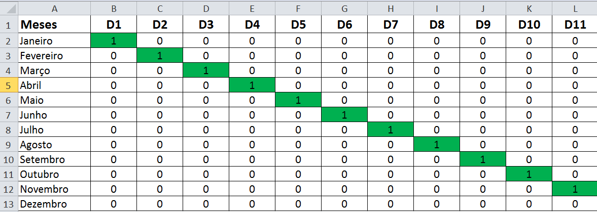
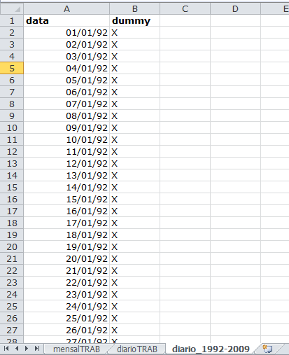
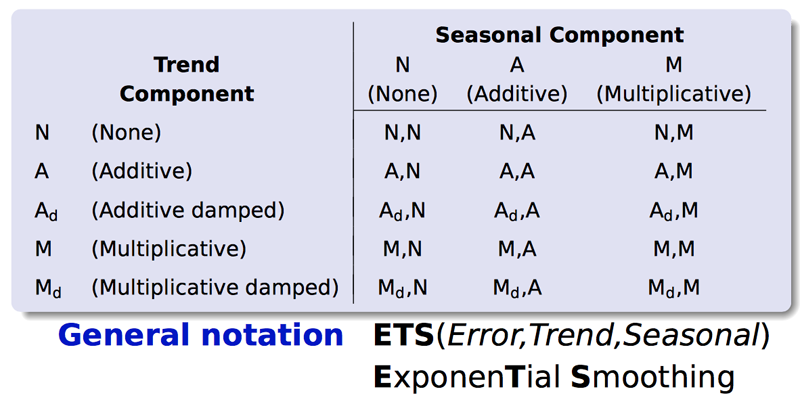

## Séries Temporais

<!-- Importacao -->

```{r, echo=FALSE, message=FALSE}
# Pacote utilizado para leitura em formato de séries temporais:
library(zoo)

## Importar as bases de dados utilizando `read.zoo`

# A base de dados e os scripts R estão no mesmo diretório (o diretório atual)
setwd(paste("~/Documents/Mestrado/UFPA/Mineração de Dados/data-mining-ppgee/trabalho-2-forecast/", sep=""));
#setwd(paste("./", sep=""));

# Inicialmente, ler a base de dados diários como um data frame (através de read.csv)
dataframe_diario <- read.csv(file = "dataset_diario.csv", sep = ";", dec = ",", header = TRUE)
# Em seguida, converter para uma série temporal (lista indexada pela data)
dataset_diario <- zoo(as.matrix(dataframe_diario[, -1:-2]), as.Date(dataframe_diario[,1], format = "%d/%m/%y"))
# Obs: em "format" usa-se y minusculo, pois a data está no formato dd/mm/yy

# A função read.zoo() abaixo não retorna lista com vetores categóricos e numéricos ao mesmo tempo.
# Isto é, se houver dados categóricos e numéricos na base, os numéricos serão convertidos.
# Por isso, a base com dados diários não foi lida diretamente com read.zoo. A base com dados mensais 
# pode ser lida diretamente com read.zoo()
# Ler o .csv como uma série temporal (indexado pela data)
dataset_mensal <- read.zoo(file = "dataset_mensal.csv", sep = ";", dec = ",", header = TRUE, 
        index = 1, tz = "", FUN = as.yearmon, format = "%m/%Y", drop = FALSE)
# index ->  coluna do arquivo .csv que contém a data
# Obs: em "format" usa-se Y maiúsculo, pois a data está no formato mm/yyyy

### Notar que é necessário definir:

# - O caractere que separa as entradas no arquivo *.csv* (`sep =`)
# - O caractere separador de casas decimais do atributo numérico presente nas bases de dados (`dec =`)                
```


<!-- Helper Functions -->

```{r, echo=FALSE}
# Funcao pra pegar a data em uma série temporal diária
getDate <- function(ts) {
  indices <- array()
  for (i in 1:length(ts)) {
    indices[i] <- which(dataset_diario == ts[i])
  }
  return(index(dataset_diario[indices]))
}

getDate2 <- function(ts) {
  indices <- array()
  for (i in 1:length(ts)) {
    indices[i] <- which(dataset_mensal == ts[i])
  }
  return(index(dataset_mensal[indices]))
}

dataByWeekday <- function(targetWeekday) {
  indices <- which(weekdays(index(dataset_diario)) == targetWeekday)
  return(dataset_diario[indices])
}

dataByMonthWeekday <- function(targetWeekday, targetMonth) {
  indices <- which(weekdays(index(dataset_diario)) == targetWeekday & months(index(dataset_diario)) == targetMonth)
  return(dataset_diario[indices])
}

holidays = c('01/01', '21/04', '01/05', '07/09', '12/10', '02/11', '15/11', '25/11', '31/12')

dynamicHolidays = c( # carnaval
                      '11/02/02','12/02/02',
                      '03/03/03','04/03/03',
                      '23/02/04','24/02/04',
                      '07/02/05','08/02/05',
                      '27/02/06','28/02/06',
                      '19/02/07','20/02/07',
                      '04/02/08','05/02/08',
                      '23/02/09','24/02/09', 
                      # Pascoa (sextas da paixao)              
                      '29/03/02',
                      '18/04/03',
                      '09/04/04',
                      '25/03/05',
                      '14/04/06',
                      '06/04/07',
                      '21/03/08',
                      '10/04/09'
                      )
isHoliday <- function(dataset) {  
  # Nota: Talvez natal e ano novo não sejam de baixa consumo energetico
  # Declare vector for containing results
  returnVec <- array()
  # Procura por feriados fixos:
  for (i in 1:length(dataset)) {     
    if (is.element(format(index(dataset[i]), "%d/%m"), holidays)) {
      returnVec[i] = TRUE;
      } else {
        returnVec[i] = FALSE;
        }
    }    
  # Procura por feriados dinamicos:
  for (i in 1:length(dataset)) {     
    if (is.element(format(index(dataset[i]), "%d/%m/%y"), dynamicHolidays) && !returnVec[i]) {
      returnVec[i] = TRUE;
      }
    }
  
  return(returnVec);
}

countMthHolidays <- function(dataset) {  
  # Função que verifica se um dado mês em um "dataset" contém feriados 
  # que não sejam no domingo.
    
  # Starting and ending years in 'dataset'
  startYear <- min(as.numeric(format(index(dataset), "%Y")))
  endYear <- max(as.numeric(format(index(dataset), "%Y")))
  yearRange <- startYear:endYear
  
  # Declare vector for containing results
  returnVec <- array(data=0, dim=(endYear - startYear + 1)*12)
  
  for (i in 1:length(yearRange) ) {
    year <- yearRange[i]
    for (month in 1:12) {
      # Define feriados fixos:
      monthHolidays <- holidays[which(as.numeric(format(as.Date(holidays, format="%d/%m"), "%m")) == month)]
      # Coloca o ano da iteracao corrente na data destes feriados:
      if(length(monthHolidays) > 0) {
        monthHolidays <- paste(monthHolidays, year, sep="/")
      }
      # Feriados dinamicos:
      monthDynHolidays <- dynamicHolidays[which(format(as.Date(dynamicHolidays, format="%d/%m/%y"), "%m/%Y") == paste(formatC(month, width=2, flag = "0"), year, sep="/"))]
      # Formata:
      monthDynHolidays <- format(as.Date(monthDynHolidays, format="%d/%m/%y"), "%d/%m/%Y")
      
      # Define um conjunto que incorpora fixos e dinamicos
      totalHolidays <- union(monthHolidays, monthDynHolidays)
        
      # Para cada feriado do conjunto      
      for (holiday in totalHolidays) {        
        #print(month + (i-1)*12)
        if (weekdays(as.Date(holiday, format="%d/%m/%Y")) != "Domingo") {
          returnVec[month + (i-1)*12] <- returnVec[month + (i-1)*12] + 1          
        }
        #print(as.Date(holiday, format="%d/%m/%Y"))        
        #print(weekdays(as.Date(holiday, format="%d/%m/%Y")))
        #print(returnVec[month + (i-1)*12])
      }
    }
  }
   
  return(returnVec);
}


countWorkDays <- function(dataset) {  
  # Função que verifica se um dado mês em um "dataset" contém feriados 
  # que não sejam no domingo.
    
  # Starting and ending years in 'dataset'
  startYear <- min(as.numeric(format(index(dataset), "%Y")))
  endYear <- max(as.numeric(format(index(dataset), "%Y")))
  yearRange <- startYear:endYear
  
  # Declare vector for containing results
  returnVec <- array(data=0, dim=(endYear - startYear + 1)*12)
  
  for (i in 1:length(yearRange) ) {
    year <- yearRange[i]
    for (month in 1:12) {
      dateStart = as.Date(paste(01, month, year, sep="/"), format="%d/%m/%Y")
      if (month < 12) {
        dateEnd = as.Date(paste(01, month+1, year, sep="/"), format="%d/%m/%Y")
      } else {
        dateEnd = as.Date(paste(01, 1, year + 1, sep="/"), format="%d/%m/%Y")
      }
    
      dayRange <- seq(from=dateStart, to=dateEnd, by="1 day")
      # Exclui a ultima entrada (primeiro dia do outro mês)
      dayRange <- dayRange[-length(dayRange)]
      
      returnVec[month + (i-1)*12] <- sum(!weekdays(dayRange) %in% c("Sábado", "Domingo"))
    }
  }
   
  return(returnVec);
}

## Function to remove repeated entries in vector of labels
removeRepeated <- function (labels) {
  for (i in 2:length(labels)) {
    if (labels[i] == labels[i-1]) {
      labels[i] = ''
      }
    if(i-2 > 0) {
      if(labels[i] == labels[i-2]) {
        labels[i] = '';
        }
      }
    if(i-3 > 0) {
      if(labels[i] == labels[i-3]) {
        labels[i] = '';
        }
      }
    if(i-4 > 0) {
      if (labels[i] == labels[i-4]) {
        labels[i] = '';
      }
    }
    
    if(i-5 > 0) {
      if (labels[i] == labels[i-5]) {
        labels[i] = '';
        }
      }
    }
  return(labels);
}
getMonthLabels <- function(weekdaySeries) {
  
  labels <- removeRepeated(months(index(weekdaySeries)));    
  return(labels)
  }

getYearLabels <- function(weekdayMonthSeries) {
  
  labels <- removeRepeated(format(index(weekdayMonthSeries), "%Y"))
  return(labels)
  }
```


<!-- Biblioteca -->

```{r, include=FALSE}
library(forecast)
```

#### Série Mensal:

`dataset_mensal` é a base com os valores de fluxo mensais de 1992 a 2009. 
```{r, cache=TRUE}
# Frequency --> número de observações por unidade de tempo 
# define a unidade de tempo (e.g. 12: unidade de tempo = ano)
tsMensal <- ts(dataset_mensal, frequency=12, start=1992)
```

```{r, echo=FALSE}
plot(tsMensal, xlab="Anos", ylab="Fluxo Mensal")
title('Dados Mensais')
```

#### Série Diária:
`dataset_diario` é a base com valores de fluxos diários de 2002 a 2009. 
```{r, cache=TRUE}
tsDiario <- msts(dataset_diario, start=c(2002,1,1), seasonal.periods=c(7, 365.25))
```

```{r, echo=FALSE}
plot(tsDiario, xlab="Anos", ylab="Fluxo")
title('Dados Diários')
```

**Nota:** é importante observar os anos bissextos, 2004 e 2008.

## Inspeção dos Dados

### Série para um dia específico da semana
```{r, echo=FALSE}
# Dados para um determinado dia da semana 
weekdaySeries <- dataByWeekday("Segunda Feira")
plot(weekdaySeries, xaxt = 'n', xlab="Mes")
title("Segunda Feira")
axis_labels <- getMonthLabels(weekdaySeries)
axis(side=1, at=index(weekdaySeries), labels=axis_labels, las=2, cex.axis=0.5)
```

### Série para um dia e mês específico da semana 
```{r, echo=FALSE}
# Dados para um determinado dia da semana e mês
# Exemplo, quinta-feira 12 de outubro de 2006, feriado
# Exemplo, quinta-feira 02 de novembro de 2006, feriado
weekdayMonthSeries <- dataByMonthWeekday("Quinta Feira", "Outubro")
plot(weekdayMonthSeries, xaxt = 'n', xlab="Mes")
title("Quinta-Feira em Outubro")
axis_labels <- getYearLabels(weekdayMonthSeries)
axis(side=1, at=index(weekdayMonthSeries), labels=axis_labels, las=2, cex.axis=0.7)
```

**Observar** a influência dos feriados (**outliers**). Exemplo, 12 de outubro foi uma quinta-feira em 2006.

## Inspeção dos Dados - 2

Pode-se observar que as séries são:

* **Tendenciosas**: apresentam padrão de crescimento ao longo do tempo.
* **Sazonais**: apresentam padrão recorrente em um determinado período de tempo.


### Fluxo Mensal
```{r, echo=FALSE}
plot(decompose(tsMensal), xlab="Anos")
```

### Fluxo Diário
```{r, echo=FALSE}
plot(decompose(tsDiario), xlab="Anos")
```

### Observações
  1. Sazonalidade de 1 ano na série mensal.
  2. Na série diária, há também sazonalidade semanal.
  
## Inspeção dos Dados - 3
  
### Fluxo Diário para um intervalo arbitrário de 8 semanas
```{r, echo=FALSE}
tsDiario_8wWindow <- window(tsDiario, start=c(2008,5), end=c(2008,61))
plot(tsDiario_8wWindow, ylab="Fluxo Diário", xaxt = 'n', xlab="Dia")
title("Intervalo arbitrário de 8 semanas")
axis_labels <- weekdays(getDate(tsDiario_8wWindow))
axis(side=1, at=index(tsDiario_8wWindow), labels=axis_labels, las=2, cex.axis=0.75)
```


## Inspeção dos Dados - 4

### Auto-correlação
```{r}
acf(dataset_diario, col="red")
```

### Parcial:
```{r}
pacf(dataset_diario, col="red")
partial_autocorr <- pacf(dataset_diario, col="red", lag.max = 600, plot = FALSE)
which((abs(partial_autocorr$acf) > 0.08) == TRUE)
```


## Objetivos

Realizar prospecções de curto, médio e longo prazo.

### Curto Prazo
  * 30 Dias
  * 45 Dias
  
Para curto prazo, será utilizada a série temporal com dados diários (`tsDiario`). 
  
### Médio Prazo
  * 4 Meses 
  * 6 Meses
  
### Longo Prazo
  * 1 Ano
  * 2 Anos
  
Para médio e longo prazo, será utilizada a série temporal com dados mensais (`tsMensal`).


## Separação dos dados

Separação das séries temporais em conjuntos de treinamento e de testes.

### Curto Prazo (`tsDiario`)

#### Conjunto de Treinamento
```{r, cache=TRUE}
tsDiarioTrain <- window(tsDiario, end=c(2008,183)) # até 30/06/2008
```

```{r, echo=FALSE, eval=FALSE}
plot(tsDiarioTrain, xlab="Anos", ylab="Fluxo Diário")
```

<!-- Confirma se os dias estão corretos: -->

```{r, echo=FALSE, message=FALSE, results='hide'}
# Últimos dias da série de treinamento:
getDate(tail(tsDiarioTrain))
```

#### Conjuntos de Teste

##### 30 dias:
```{r, cache=TRUE}
# De 01/07/2008 a 30/07/2008
tsDiarioTest30Days <- window(tsDiario, start=c(2008,184), end=c(2008,213)) 
```

<!-- Confirma se os dias estão corretos: -->

```{r, echo=FALSE, message=FALSE, eval=FALSE}
# Checagem pra verificar se o eixo temporal em tsDiarioTest30Days está correto: 
plot(window(tsDiario, start=c(2008,170), end=c(2008,230)))
lines(tsDiarioTest30Days, col="red")
```


##### 45 dias:
```{r, cache=TRUE}
# 45 dias a partir De 1/1/2008
tsDiarioTest45Days <- window(tsDiario, start=c(2008,184), end=c(2008,228)) 
```

```{r, echo=FALSE, message=FALSE, eval=FALSE}
#### Checagem pra verificar se o eixo temporal em tsDiarioTest45Days está correto: 
plot(window(tsDiario, start=c(2008,170), end=c(2008,260)))
lines(tsDiarioTest45Days, col="red")
```

### Médio/Longo Prazo (`tsMensal`)

#### Conjunto de Treinamento
```{r, cache=TRUE}
tsMensalTrain <- window(tsMensal, end=c(2007, 12)) # De Jan 1992 a Dez 2007
```

```{r, echo=FALSE, eval=FALSE}
plot(tsMensalTrain, xlab="Anos", ylab="Fluxo Mensal")
```

#### Conjuntos de Teste

##### 4 meses:
```{r}
tsMensalTest4mth <- window(tsMensal, start=2008, end=c(2008, 4)) # De Jan 2006 a Mar 2006
```

##### 6 meses:
```{r}
tsMensalTest6mth <- window(tsMensal, start=2008, end=c(2008, 6)) # De Jan 2006 a Jun 2006
```

##### 1 ano:
```{r}
tsMensalTest1yr <- window(tsMensal, start=2008, end=c(2008, 12)) # De Jan 2006 a Jan 2007
```

##### 2 anos:
```{r}
tsMensalTest2yr <- window(tsMensal, start=2008, end=c(2009, 12)) # De Jan 2006 a Jan 2008
```


## Transformação Box-Cox

É possível observar um fator multiplicativo na componente sazonal. Por isso, a transformação Box-Cox será utilizada em alguns dos métodos apresentados na sequência.

* $W_t = \begin{cases} \log\left(y_t\right) & \lambda = 0\\ \frac{(y_t^\lambda - 1)}{\lambda} & \lambda \neq 0\end{cases}$

### Série original
```{r}
plot(tsMensalTrain, xlab="Anos", ylab="Fluxo Mensal")
```

### Série transformada
Calcula-se o fator $\lambda$ para a transformação:
```{r, cache=TRUE}
lam <- BoxCox.lambda(tsMensalTrain)
lam
```

Série Resultante:
```{r, cache=TRUE}
tsMensalBoxCox <- BoxCox(x = tsMensalTrain, lam)
```

```{r}
plot(tsMensalBoxCox, col="red")
```


## Bibliotecas Utilizada

### Prospecções Estatísticas

ver [@hyndmanForecastingR] e [@practicalMachineLearningForecasting]:
```{r, message=FALSE}
library(forecast)
```

### Redes Neurais:
```{r, message=FALSE}
library(nnet)
```

## Predição a Médio Prazo

* **ARIMA**
* **Exponential Smoothing**


## Modelo ARIMA

ARIMA (*Autoregressive Integrated Moving Average*)

* Combinação dos modelos:
    * auto-regressivo (AR)
    * médias-móveis (MA)

* Método ARMA, acrescido da etapa de integração (I).

* Caso a série temporal seja estacionária, o método se reduz ao ARMA.

### Equação de Predição

$$y(t) = \sum_{i=1}^{p}\varphi_iy(t-i) + \sum_{j=1}^{q}\theta_j\epsilon(t-j)$$

### Notação
$ARIMA(p,d,q)$, onde:

* p = número de valores passados da variável (AR)

* d = número de diferenças não-sazonais (I)

* q = número de erros de predição passados (MA)


## Função `auto.arima` no R

* A função `auto.arima` ajusta o melhor modelo ARIMA à série temporal, com base no menor parâmetro AIC.

* Protótipo com os principais parâmetros:

**auto.arima**(x, max.p=$5$, max.d=$2$, max.q=$5$, stationary=$FALSE$,
seasonal=$TRUE$, approximation=$TRUE$, xreg=$NULL$)

* Com todos os parâmetros automáticos, a função `auto.arima` forneceu predições ruins.


## Regressores Adicionais

* Aumentar o número de termos na equação de regressão do modelo ARIMA.

* Adicionar ao modelo informações que possuem alta correlação com a série temporal em questão.


## Regressores incorporados ao modelo ARIMA

### Indicação dos meses dos conjuntos mensais de treinamento/teste.

Regressor que pode assumir $12$ categorias possíveis: janeiro, fevereiro, ..., dezembro.




### Quantas segundas, terças, ..., domingos há em cada mês.

Base `dataset_diario_1992-2009.csv`, com as datas diárias de Jan de 1992 a Dez de 2009.




```{r, echo=FALSE, cache=TRUE}
# Série temporal contendo datas diárias, de Jan 1992 a Dez 2009
dataframe_diario_full <- read.csv(file = "dataset_diario_1992-2009.csv", sep = ",", dec = ".", header = TRUE)
dataset_diario_full <- zoo(as.matrix(dataframe_diario_full[,-1:-2]), as.Date(dataframe_diario_full[,1], format = "%d/%m/%y"))
```


```{r, echo=FALSE}
# Carregar funções definidas em arquivos separados
source("countWorkDays.R")
source("countMthHolidays.R")
source("countWeekdaysPerMonth.R")
source("getMonths.R")
```

## Treinamento do Modelo ARIMA em prospecções de Médio Prazo

### Regressores externos utilizados no treinamento
```{r, message=FALSE, cache=TRUE}

# datas diárias do conjunto de treinamento, de Jan 1992 a Dez 2007
datasDiarioTrain_Mensal <- window(index(dataset_diario_full), end=5844)

# Série contendo as datas do conjunto de treinamento, de Jan 1992 a Dez 2007
datasMensalTrain <- dataset_mensal[1:192]

# Indica quais são os meses (janeiro, ..., dezembro) do conjunto de treinamento
meses <- getMonths( format(index(datasMensalTrain),"%m") )

# conta quantas segundas,...,domingos há em cada mês do conjunto de treinamento
diasSemanasMes_treino <- countWeekdaysPerMonth(datasDiarioTrain_Mensal)
```

### Modelo utilizando os regressores adicionais: Indicação dos meses e Quantidade dos dias da semana de cada mês
```{r, cache=TRUE}
arima_model_mensal <- auto.arima(tsMensalTrain, approximation=FALSE, lambda=BoxCox.lambda(tsMensalTrain), xreg=cbind(meses,diasSemanasMes_treino))
```


## Método ARIMA em prospecções de Médio Prazo

### Para 4 meses

```{r}
mesesAPrever <- 4
```


```{r, message=FALSE, cache=TRUE}

# Série contendo as datas do conjunto de testes, de Jan 2008 a Abr 2008
datasMensal4mth <- dataset_mensal[193:196]

# Indica quais são os meses (janeiro, ..., dezembro) do conjunto de testes
mesesFuturo4 <- getMonths( format(index(datasMensal4mth),"%m") )


# número de dias úteis nos meses do conjunto de teste (4 meses)
diasUteisFuturo_4mth <- countWorkDays(datasMensal4mth) - countMthHolidays(datasMensal4mth)
diasUteisFuturo_4mth <- aperm(diasUteisFuturo_4mth)


# datas diárias do conjunto de teste (4 meses)
datasDiarioTeste4mth_Mensal <- window(index(dataset_diario), start=2192, end=2312)

# conta quantas segundas,...,domingos há em cada mês do conjunto de teste (4 meses)
diasSemanasMes_futuro_4mth <- countWeekdaysPerMonth(datasDiarioTeste4mth_Mensal)
```

Predição:
```{r}
fcast_arima_4mth <- forecast(arima_model_mensal, xreg=cbind(mesesFuturo4,diasSemanasMes_futuro_4mth), h=mesesAPrever)

plot(fcast_arima_4mth, xlab="Anos", ylab="Fluxo Mensal", include=36)
lines(tsMensalTest4mth, col="red")
```

Acurácia:
```{r}
accuracy(fcast_arima_4mth, tsMensalTest4mth)
```


## Método ARIMA em prospecções de Médio Prazo

### Para 6 meses

```{r, cache=TRUE}
mesesAPrever <- 6
```

Predição:
```{r, message=FALSE, cache=TRUE}
datasMensal6mth <- window(index(dataset_mensal), start=193, end=198)
mesesFuturo6 <- getMonths( format(datasMensal6mth,"%m") )

# quantas segundas, tercas, ..., domingos há em cada mês do conjunto de teste (6 meses)
datasDiarioTeste6mth_Mensal <- window(index(dataset_diario), start=2192, end=2373)

diasSemanasMes_futuro_6mth <- countWeekdaysPerMonth(datasDiarioTeste6mth_Mensal)


fcast_arima_6mth <- forecast(arima_model_mensal, xreg=cbind(mesesFuturo6,diasSemanasMes_futuro_6mth), h=mesesAPrever)
```

Predição:
```{r}
plot(fcast_arima_6mth, xlab="Anos", ylab="Fluxo Mensal", include=36)
lines(tsMensalTest6mth, col="red")
```

Acurácia:
```{r}
accuracy(fcast_arima_6mth, tsMensalTest6mth)
```


## *Exponential Smoothing*

* Médias móveis simples pondera igualmente as observações passadas em uma série temporal.
* Exponential smoothing atribui pesos que decrescem exponencialmente ao longo do tempo, levando em consideração:
    * Erro
    * Tendência
    * Sazonalidade
* Estes parâmetros podem ser escolhidos como (e.g. tendência $T_h$, assumindo um termo de nível $l$ e termo de crescimento $b$, para $h$ períodos temporais e $0 < \phi < 1$):
    * Nulo:    $T_h = l$ 
    * Aditivo:    $T_h = l + bh$
    * Aditivo amortecido:     $T_h = l + \left( \phi + \phi^2 + \cdots + \phi^h \right)b$
    * Multiplicativo:     $T_h = l b^h$
    * Multiplicativo amortecido:    $T_h = l b^{\left( \phi + \phi^2 + \cdots + \phi^h \right)}$
  

## *Exponential Smoothing* - 2

Ver [@HyndmanAthanasopoulos201310]. O autor possui um livro exclusivamente sobre o assunto em [@HyndmanKoehlerOrdSnyder200807].



Para cada um dos 15 métodos, há dois modelos possíveis: com erro aditivo e com erro multiplicativo. 

### Há, portanto, 30 métodos distintos.

## *Exponential Smoothing* no R

* A função `ets(ts)` sem argumentos além da série temporal `ts` determina automaticamente o método apropriado.
* O algoritmo avalia os 30 métodos e busca aquele que tiver o menor AIC.
    * AIC - "Akaike information criterion": uma estimativa da informação perdida quando um determinado modelo é usado para representar o verdadeiro processo que gera a série temporal.
* Ao final, o objeto retornado por `ets` apresenta o modelo escolhido e o AIC resultante.
* A função `ets` não trabalha com séries cuja sazonalidade é superior a 24 unidades temporais. Portanto, será utilizada somente pra prospecções realizadas com dados mensais (sazonalidade = 12).
* O modelo `ets` parametrizado automáticamente deve dar resultados muito precisos para prospecções de poucos pontos (por exemplo, 4 pontos). 

## Método *Exponential Smoothing* em Médio Prazo

### Para 6 meses
```{r}
mesesAPrever <- 6
```

Modelo:
```{r, cache=TRUE}
etsMensal <- ets(tsMensalTrain)
```

Prospecção:
```{r, cache=TRUE}
fcastMensal6mth <- forecast(etsMensal, h=mesesAPrever)
```

Comparar predição com valores reais do conjunto de teste:
```{r}
plot(fcastMensal6mth, xlab="Anos", ylab="Fluxo Mensal", include = 36);
lines(tsMensalTest6mth, col="red")
legend("topleft",legend=c("Real"),col=2,lty=1)
```

Acurácia:
```{r}
accuracy(fcastMensal6mth, tsMensalTest6mth)
```


## Predição a Longo Prazo

* **Prospecção com decomposição sazonal de Loess** (STL)


## Prospecção com decomposição sazonal de Loess - STLF

1. Aplica-se a decomposição STL
1. Remove-se a sazonalidade da série temporal
2. Um modelo é treinado na série resultante
3. Faz-se a prospecção
4. Adiciona-se novamente o último período da sazonalidade estimada nos resultados

```{r}
mesesAPrever <- 24
```

Dados com sazonalidade removida:
```{r}
tsMensal.stl <- stl(tsMensalTrain[,1], s.window=12)
# Seasonally adjusted data constructed by removing the seasonal component.
plot(seasadj(tsMensal.stl))
```

```{r}
stlf_model <- stlf(tsMensalTrain[,1], lambda = lam)
stlf_fcast <- forecast(stlf_model, h=mesesAPrever)
plot(stlf_fcast, xlab="Anos", ylab="Fluxo Mensal")
lines(tsMensalTest2yr, col="red")
```

Acurácia:
```{r, cache=TRUE}
accuracy(stlf_fcast, tsMensalTest1yr)
```


## Predição a curto prazo

* **Rede Neural**
* **TBATS**

## Rede Neural

### Pacotes
```{r, message=FALSE}
require(quantmod) 
require(nnet)
```


```{r, echo=FALSE}
set.seed(12)

# Helper functions:
mape <- function(y, yhat) {
  # y -> actual
  # yhat -> predicted
  mean(abs((y - yhat)/y))
}

normalize <- function(tSeries, refDataset) {
  # tSeries -> Time Series to Normalize
  # refDataset -> Reference Dataset, from which
  # min and max values are taken
  tsMin <- min(refDataset)
  tsMax <- max(refDataset)
  return((tSeries - tsMin)/ (tsMax - tsMin))
} 

# Using nnet directly on dataset
# Prepare data frame

dataset <- dataset_diario
```


### Escolha das entradas:
```{r}
partial_autocorr <- pacf(dataset_diario, col="red", lag.max = 600, plot = FALSE)
which((abs(partial_autocorr$acf) > 0.1) == TRUE)
```

```{r}
dat <- data.frame( y=dataset, 
                   Lag(dataset,1),                                           
                   Lag(dataset,3),
                   Lag(dataset,4),                   
                   Lag(dataset,7),
                   Lag(dataset,14),
                   Lag(dataset,15),                      
                   Lag(dataset,35),
                   Lag(dataset,364),
                   month=as.numeric(format(index(dataset), "%m")), 
                   year=(as.numeric(format(index(dataset), "%y")) - 1), 
                   holiday=isHoliday(dataset))
```

```{r, echo=FALSE}
# Index for split into train/test sets:
testStartYear <- "07/09"
lastTrainIndex <- min(which(format(as.Date(rownames(dat)), "%m/%y") == testStartYear)) - 1

#
# Normalize lagged inputs according to the training set:
#

# Find the "Lag.x" columns
lagColumns <- grep("^Lag", colnames(dat), value = TRUE)
# Update (normalize and apply log) these columns:
for (col in lagColumns) { 
  # Normalize based on the training set
  dat[col] <- log(normalize(dat[col], dataset[1:lastTrainIndex]) + 1)
}

# Split training and testing sets:
datTrain <- dat[1:lastTrainIndex,]
datTest <- dat[-(1:lastTrainIndex),]
```


### Modelo
```{r}
model  <- nnet(y ~ ., data = datTrain, repeats=50, size=3, decay=0.01, linout=TRUE, trace=FALSE, 
               maxit=10000)
model
```

### Predição 30 dias
```{r, echo=FALSE}
# Steps ahead to predict:
nPredict <- 30;

# Declare Prediction Array
fcast <- array(dim = c(nPredict, 1))
predictDates <- array(dim = c(nPredict, 1))

# Prediction
# Iteratively updates the lags in each row of the data frame
for (i in 1:nPredict) {
  # Predict for the current i-th row:
  currentPred <- predict(model, datTest[i,])
  # Save prediction to forecast vector:
  fcast[i] <- currentPred[1]
  # Save prediction date to a vector of dates:
  predictDates[i] <- rownames(currentPred)
  #
  # Lag Updates
  #
  # First, find the "Lag.x" columns
  lagColumns <- grep("^Lag", colnames(dat), value = TRUE)
  # In each "Lag.x", identify the number x, corresponding to the delay:
  delays <- as.numeric(sub(pattern = "Lag.", replacement = "", x = lagColumns))
  # Then, for each delay, update the corresponding "future" samples
  # with the current prediction, such that their lagged value matches the current
  # predicted value (not the actual value, as would be otherwise):
  for (delay in delays) {
    lagColumnName <- lagColumns[which(delays == delay)]
    if (i+delay < nPredict) {
      # Again, normalization is based on the training set
      datTest[i+delay, lagColumnName] <- log(normalize(currentPred[1], datTrain$y) + 1)
    }
  }
}
# Finally, update the row names in the forecast vector with the prediction dates:
rownames(fcast) <- predictDates

# Plot results:
plot(as.Date(rownames(fcast), format="%Y-%m-%d"), fcast, type="l", col=3, xlab="Data", ylab="Fluxo Diário")
lines(as.Date(rownames(fcast), format="%Y-%m-%d"), datTest$y[1:nPredict], type="l",col = 2)
legend("bottomright",legend=c("Forecast", "Real"),col=c(3,2),lty=1,  cex = 0.9)
```

#### Acurácia
```{r}
mape(datTest$y[1:nPredict], fcast)*100
```

### Predição 45 dias
```{r, echo=FALSE}
# Steps ahead to predict:
nPredict <- 45;

# Declare Prediction Array
fcast <- array(dim = c(nPredict, 1))
predictDates <- array(dim = c(nPredict, 1))

# Prediction
# Iteratively updates the lags in each row of the data frame
for (i in 1:nPredict) {
  # Predict for the current i-th row:
  currentPred <- predict(model, datTest[i,])
  # Save prediction to forecast vector:
  fcast[i] <- currentPred[1]
  # Save prediction date to a vector of dates:
  predictDates[i] <- rownames(currentPred)
  #
  # Lag Updates
  #
  # First, find the "Lag.x" columns
  lagColumns <- grep("^Lag", colnames(dat), value = TRUE)
  # In each "Lag.x", identify the number x, corresponding to the delay:
  delays <- as.numeric(sub(pattern = "Lag.", replacement = "", x = lagColumns))
  # Then, for each delay, update the corresponding "future" samples
  # with the current prediction, such that their lagged value matches the current
  # predicted value (not the actual value, as would be otherwise):
  for (delay in delays) {
    lagColumnName <- lagColumns[which(delays == delay)]
    if (i+delay < nPredict) {
      # Again, normalization is based on the training set
      datTest[i+delay, lagColumnName] <- log(normalize(currentPred[1], datTrain$y) + 1)
    }
  }
}
# Finally, update the row names in the forecast vector with the prediction dates:
rownames(fcast) <- predictDates

# Plot results:
plot(as.Date(rownames(fcast), format="%Y-%m-%d"), fcast, type="l", col=3, xlab="Data", ylab="Fluxo Diário")
lines(as.Date(rownames(fcast), format="%Y-%m-%d"), datTest$y[1:nPredict], type="l",col = 2)
legend("bottomright",legend=c("Forecast", "Real"),col=c(3,2),lty=1,  cex = 0.9)
```

#### Acurácia
```{r}
mape(datTest$y[1:nPredict], fcast)*100
```

## Modelo TBATS

* Técnica recente, publicada em 2011 [@tbats_paper2011].

* A sigla TBATS é composta das iniciais das técnicas utilizadas: Trigonométrica, transformação Box-cox, correção de erro pela técnica ARMA, e componentes Trend e Sazonal.

* Desenvolvido para séries temporais com características especiais de sazonalidade.


### Justificativa

* Por inspeção visual do fluxo diário, supõe-se que a série temporal apresenta sazonalidades semanal e anual.

### Modelo TBATS, a partir da série multi-sazonal do conjunto de treinamento:
```{r, cache=TRUE}
tbats_model <- tbats(tsDiarioTrain,                      
                     use.box.cox = TRUE, 
                     use.trend = TRUE, 
                     use.damped.trend = FALSE,
                     seasonal.periods = c(7, 29.6, 365.25),
                     use.arma.errors = TRUE)                    
```

#### Decomposição do fluxo diário em termos trend+season pelo método TBATS
```{r, echo=FALSE}
plot(tbats_model)
```


O método TBATS é indicado para a previsão do fluxo diário, pois:

1. Sazonalidades múltiplas: semanal e anual

2. Sazonalidade semanal é de alta frequência


## Método TBATS em prospecções de Curto Prazo

### Para 30 dias

```{r}
diasAPrever <- 30
```

Predição:
```{r}
tbats_fc30Days <- forecast(tbats_model, h=diasAPrever)
```

```{r, echo=FALSE}
plot(tbats_fc30Days, include = 120)
lines(tsDiarioTest30Days, col="red")
legend("topleft",legend=c("Real"),col=2,lty=1)
```

Acurácia:
```{r, echo=FALSE}
accuracy(tbats_fc30Days, tsDiarioTest30Days)
```


## Método TBATS em prospecções de Curto Prazo

### Para 45 dias

```{r}
diasAPrever <- 45
```

Predição:
```{r}
tbats_fc45Days <- forecast(tbats_model, h=diasAPrever)
```

```{r, echo=FALSE}
plot(tbats_fc45Days, include = 120)
lines(tsDiarioTest45Days, col="red")
legend("topleft",legend=c("Real"),col=2,lty=1)
```

Acurácia:
```{r, echo=FALSE}
accuracy(tbats_fc45Days, tsDiarioTest45Days)
```


## Benchmark Métodos Utilizados

<!-- Prospeccoes a curto Prazo -->

<!-- 30 dias -->

```{r, echo=FALSE}
nPredict <- 30
tsTrain <- tsDiarioTrain
tsTest <- tsDiarioTest30Days


# Média
f_mean <- meanf(tsTrain, h=nPredict)
mape_mean_accuracy <- accuracy(f_mean, tsTest)[,5]
# Naïve
f_naive <- naive(tsTrain, h=nPredict)
mape_naive_accuracy <- accuracy(f_naive, tsTest)[,5]
# Naïve Sazonal
f_seasonal_naive <- snaive(tsTrain, h=nPredict)
mape_naiveseaz_accuracy <- accuracy(f_seasonal_naive, tsTest)[,5]
# Drift
f_drift <- rwf(tsTrain, drift = TRUE, h=nPredict)
mape_drif_accuracy <- accuracy(f_drift, tsTest)[,5]
# Regressao
reg <- tslm(tsTrain ~ trend + season)
regfcast <- forecast(reg, h=nPredict)
reg_accuracy <- accuracy(regfcast, tsTest)[,5]
# Nota: ETS não é apropriado pra curto prazo
# ARIMA
arima_model <- auto.arima(tsTrain)
fcast_arima <- forecast(arima_model, h=nPredict)
arima_accuracy <- accuracy(fcast_arima, tsTest)[,5]
# Tbats
tbats_model <- tbats(tsTrain,                      
                     use.box.cox = TRUE, 
                     use.trend = TRUE, 
                     use.damped.trend = FALSE,
                     seasonal.periods = c(7, 29.6, 365.25),
                     use.arma.errors = TRUE) 
tbats_fcast <- forecast(tbats_model, h=nPredict)
tbats_accuracy <- accuracy(tbats_fcast, tsTest)[,5]


accuracies <- data.frame(mape_mean_accuracy, 
                         mape_naive_accuracy, 
                         mape_naiveseaz_accuracy,
                         mape_drif_accuracy,
                         reg_accuracy,
                         arima_accuracy,
                         tbats_accuracy)

colnames(accuracies) <- c("Mean", "Näive", "N-Sazonal", "Drift", "Regressao", "ARIMA", "TBATS")

acc_train <- accuracies[1,]
acc_test30days <- accuracies[2,]
rownames(acc_test30days) <- "Test (30d)"
```


<!-- 45 dias -->

```{r, echo=FALSE}
nPredict <- 45
tsTrain <- tsDiarioTrain
tsTest <- tsDiarioTest45Days


# Média
f_mean <- meanf(tsTrain, h=nPredict)
mape_mean_accuracy <- accuracy(f_mean, tsTest)[,5]
# Naïve
f_naive <- naive(tsTrain, h=nPredict)
mape_naive_accuracy <- accuracy(f_naive, tsTest)[,5]
# Naïve Sazonal
f_seasonal_naive <- snaive(tsTrain, h=nPredict)
mape_naiveseaz_accuracy <- accuracy(f_seasonal_naive, tsTest)[,5]
# Drift
f_drift <- rwf(tsTrain, drift = TRUE, h=nPredict)
mape_drif_accuracy <- accuracy(f_drift, tsTest)[,5]
# Regressao
reg <- tslm(tsTrain ~ trend + season)
regfcast <- forecast(reg, h=nPredict)
reg_accuracy <- accuracy(regfcast, tsTest)[,5]
# Nota: ETS não é apropriado pra curto prazo
# ARIMA
fcast_arima <- forecast(arima_model, h=nPredict)
arima_accuracy <- accuracy(fcast_arima, tsTest)[,5]
# Tbats
tbats_fcast <- forecast(tbats_model, h=nPredict)
tbats_accuracy <- accuracy(tbats_fcast, tsTest)[,5]


accuracies <- data.frame(mape_mean_accuracy, 
                         mape_naive_accuracy, 
                         mape_naiveseaz_accuracy,
                         mape_drif_accuracy,
                         reg_accuracy,
                         arima_accuracy,
                         tbats_accuracy)

colnames(accuracies) <- c("Mean", "Näive", "N-Sazonal", "Drift", "Regressao", "ARIMA", "TBATS")

acc_test45days <- accuracies[2,]
rownames(acc_test45days) <- "Test (45d)"

```

### Curto prazo 
```{r, echo=FALSE}
data.frame(t(acc_train), t(acc_test30days), t(acc_test45days))
```


<!-- Prospeccoes a medio e longo Prazo -->

<!-- 4 meses -->

```{r, echo=FALSE, cache=TRUE}
nPredict <- 4
tsTrain <- tsMensalTrain
tsTest <- tsMensalTest4mth

# Média
f_mean <- meanf(tsTrain, h=nPredict)
mape_mean_accuracy <- accuracy(f_mean, tsTest)[,5]
# Naïve
f_naive <- naive(tsTrain, h=nPredict)
mape_naive_accuracy <- accuracy(f_naive, tsTest)[,5]
# Naïve Sazonal
f_seasonal_naive <- snaive(tsTrain, h=nPredict)
mape_naiveseaz_accuracy <- accuracy(f_seasonal_naive, tsTest)[,5]
# Drift
f_drift <- rwf(tsTrain, drift = TRUE, h=nPredict)
mape_drif_accuracy <- accuracy(f_drift, tsTest)[,5]
# Regressao Linear
reg <- tslm(tsTrain ~ trend + season)
regfcast <- forecast(reg, h=nPredict)
reg_accuracy <- accuracy(regfcast, tsTest)[,5]
# ETS
etsMensal <- ets(tsTrain)
fcastMensal <- forecast(etsMensal, h=nPredict)
ets_accuracy <- accuracy(fcastMensal, tsTest)[,5]
# Arima
arima_model <- auto.arima(tsTrain)
fcast_arima <- forecast(arima_model, h=nPredict)
arima_accuracy <- accuracy(fcast_arima, tsTest)[,5]

accuracies <- data.frame(mape_mean_accuracy, 
                         mape_naive_accuracy, 
                         mape_naiveseaz_accuracy,
                         mape_drif_accuracy,
                         reg_accuracy,
                         ets_accuracy,
                         arima_accuracy)

colnames(accuracies) <- c("Mean", "Näive", "N-Sazonal", "Drift", "Regressao", "ETS", "Arima")

acc_train <- accuracies[1,]
acc_test4mths <- accuracies[2,]
rownames(acc_test4mths) <- "Test (4mths)"
```

<!-- 6 meses -->
```{r, echo=FALSE, cache=TRUE}
nPredict <- 6
tsTrain <- tsMensalTrain
tsTest <- tsMensalTest6mth

# Média
f_mean <- meanf(tsTrain, h=nPredict)
mape_mean_accuracy <- accuracy(f_mean, tsTest)[,5]
# Naïve
f_naive <- naive(tsTrain, h=nPredict)
mape_naive_accuracy <- accuracy(f_naive, tsTest)[,5]
# Naïve Sazonal
f_seasonal_naive <- snaive(tsTrain, h=nPredict)
mape_naiveseaz_accuracy <- accuracy(f_seasonal_naive, tsTest)[,5]
# Drift
f_drift <- rwf(tsTrain, drift = TRUE, h=nPredict)
mape_drif_accuracy <- accuracy(f_drift, tsTest)[,5]
# Regressao Linear
reg <- tslm(tsTrain ~ trend + season)
regfcast <- forecast(reg, h=nPredict)
reg_accuracy <- accuracy(regfcast, tsTest)[,5]
# ETS
etsMensal <- ets(tsTrain)
fcastMensal <- forecast(etsMensal, h=nPredict)
ets_accuracy <- accuracy(fcastMensal, tsTest)[,5]
# Arima
arima_model <- auto.arima(tsTrain)
fcast_arima <- forecast(arima_model, h=nPredict)
arima_accuracy <- accuracy(fcast_arima, tsTest)[,5]

accuracies <- data.frame(mape_mean_accuracy, 
                         mape_naive_accuracy, 
                         mape_naiveseaz_accuracy,
                         mape_drif_accuracy,
                         reg_accuracy,
                         ets_accuracy,
                         arima_accuracy)

colnames(accuracies) <- c("Mean", "Näive", "N-Sazonal", "Drift", "Regressao", "ETS", "Arima")

acc_train <- accuracies[1,]
acc_test6mths <- accuracies[2,]
rownames(acc_test6mths) <- "Test (6mths)"
```

<!-- 12 meses -->

```{r, echo=FALSE, cache=TRUE}
nPredict <- 12
tsTrain <- tsMensalTrain
tsTest <- tsMensalTest1yr

# Média
f_mean <- meanf(tsTrain, h=nPredict)
mape_mean_accuracy <- accuracy(f_mean, tsTest)[,5]
# Naïve
f_naive <- naive(tsTrain, h=nPredict)
mape_naive_accuracy <- accuracy(f_naive, tsTest)[,5]
# Naïve Sazonal
f_seasonal_naive <- snaive(tsTrain, h=nPredict)
mape_naiveseaz_accuracy <- accuracy(f_seasonal_naive, tsTest)[,5]
# Drift
f_drift <- rwf(tsTrain, drift = TRUE, h=nPredict)
mape_drif_accuracy <- accuracy(f_drift, tsTest)[,5]
# Regressao Linear
reg <- tslm(tsTrain ~ trend + season)
regfcast <- forecast(reg, h=nPredict)
reg_accuracy <- accuracy(regfcast, tsTest)[,5]
# ETS
fcastMensal <- forecast(etsMensal, h=nPredict)
ets_accuracy <- accuracy(fcastMensal, tsTest)[,5]
# Arima
fcast_arima <- forecast(arima_model, h=nPredict)
arima_accuracy <- accuracy(fcast_arima, tsTest)[,5]


accuracies <- data.frame(mape_mean_accuracy, 
                         mape_naive_accuracy, 
                         mape_naiveseaz_accuracy,
                         mape_drif_accuracy,
                         reg_accuracy,
                         ets_accuracy,
                         arima_accuracy)

colnames(accuracies) <- c("Mean", "Näive", "N-Sazonal", "Drift", "Regressao", "ETS", "Arima")

acc_test1yr <- accuracies[2,]
rownames(acc_test1yr) <- "Test (1yr)"
```

<!-- 24 meses -->

```{r, echo=FALSE, cache=TRUE}
nPredict <- 24
tsTrain <- tsMensalTrain
tsTest <- tsMensalTest2yr

# Média
f_mean <- meanf(tsTrain, h=nPredict)
mape_mean_accuracy <- accuracy(f_mean, tsTest)[,5]
# Naïve
f_naive <- naive(tsTrain, h=nPredict)
mape_naive_accuracy <- accuracy(f_naive, tsTest)[,5]
# Naïve Sazonal
f_seasonal_naive <- snaive(tsTrain, h=nPredict)
mape_naiveseaz_accuracy <- accuracy(f_seasonal_naive, tsTest)[,5]
# Drift
f_drift <- rwf(tsTrain, drift = TRUE, h=nPredict)
mape_drif_accuracy <- accuracy(f_drift, tsTest)[,5]
# Regressao Linear
reg <- tslm(tsTrain ~ trend + season)
regfcast <- forecast(reg, h=nPredict)
reg_accuracy <- accuracy(regfcast, tsTest)[,5]
# ETS
fcastMensal <- forecast(etsMensal, h=nPredict)
ets_accuracy <- accuracy(fcastMensal, tsTest)[,5]
# Arima
fcast_arima <- forecast(arima_model, h=nPredict)
arima_accuracy <- accuracy(fcast_arima, tsTest)[,5]

accuracies <- data.frame(mape_mean_accuracy, 
                         mape_naive_accuracy, 
                         mape_naiveseaz_accuracy,
                         mape_drif_accuracy,
                         reg_accuracy,
                         ets_accuracy,
                         arima_accuracy)

colnames(accuracies) <- c("Mean", "Näive", "N-Sazonal", "Drift", "Regressao", "ETS", "Arima")

acc_test2yr <- accuracies[2,]
rownames(acc_test2yr) <- "Test (2yr)"
```

### Médio e Longo prazo 
```{r, echo=FALSE}
data.frame(t(acc_train), t(acc_test4mths), t(acc_test6mths), t(acc_test1yr), t(acc_test2yr))
```


## Referências


