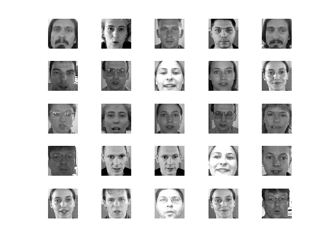
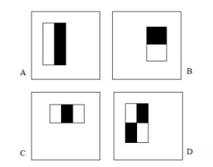

```{r, echo=FALSE, message=FALSE, warning=FALSE}
# Load dependencies and dataset
library(doMC)
registerDoMC()
load('./matlab/data/data.Rd')
```

## Agenda

1. Problemática
2. Objetivos
3. Fluxo de Trabalho
4. Pré-processamento e transformações
5. Algoritmos de Aprendizado
6. Resultados


## Problemática: Detecção de Objetos em Imagens

#### Desafio disponível no *kaggle.com*: "Facial Keypoints Detection''

* Base de treinamento contendo 7049 imagens e suas coordenadas de pontos chaves: Olhos, Sobrancelhas, Nariz e Boca
* Base de teste com 1783 imagens



*Dados fornecidos pelo Dr. Yoshua Bengio, da University of Montreal*


## Objetivos

### Identificar e localizar a boca em uma face humana

Dados disponíveis na base:

- 'mouth_left_corner': canto esquerdo
- 'mouth_right_corner': canto direito
- 'mouth_center_top_lip': centro do lábio superior
- 'mouth_center_bottom_lip': centro do lábio inferior 

### Métrica de Avaliação
Ajustar "caixa" retangular sobre as coordenadas acima e avaliar o RMSE com relação as dados verdadeiros.

## Workflow

###Fluxo de trabalho em detecção de imagens:

1. Pré-processamemto
2. Extração de *Features*
3. Treinamento de modelos 
4. *Fitting*


## Pré-processamento

- Atribuir identificador 'NaN' para dados  (coordenadas) ausentes
- Converter imagens na base dadas como vetores 'Char' para matrizes 'Int8' de dimensões $96 \times 96$
- Para o MATLAB, dividir estas matrizes por 255 e salvar as matrizes resultantes (com elementos de 0 a 1) como imagens em *grayscale* 

## Separação de Dados

- Os dados de teste da base disponibilizada pelo *Kaggle.com* não contém os dados verdadeiros, somente as imagens, já que trata-se de uma competição.
- Por isso, separa-se os dados da base de treinamento em novos conjuntos de **Treino** e **Teste**, na proporção de 80 e 20%, respectivamente, amostrados aleatoriamente sem reposição.

## Extração de Features

### Motivação 
* Melhor representação do conhecimento em comparação aos pixels puros
* O uso de *features* permite operações muito mais rápidas 

### *Features* utilizados
* Image Patches - método de identifição através da correlação
* Haar features (features rectangulares) - método de Viola-Jones

## Features retangulares e a Representação Imagem Integral

* Reminescentes das funções base de wavelets Haar

### Tipos
* "dois-retângulos": valor é a diferença entre a soma dos pixels de cada um dos retângulos 
* "três-retângulos": soma dos pixels nos dois retângulos externos subtraída da soma dos pixels no retângulo interno
* "quatro-retângulos": diferença entre as somas dos pixels dos pares de retângulos diagonais



**Nota:** para cada um destes tipos, as dimensões dos retângulos podem ser variadas, o que permite um número extremamente elevado de combinações de features em uma imagem (ex. Uma imagem 24 x 24 possui mais de 160 mil features) 

### Imagem Integral
* Esta representação é uma das três contribuições principais do trabalho de Viola-Jones
* O valor de uma imagem nas coordenadas (x, y) corresponde à soma de todos os pixels acima e à esquerda de (x, y), inclusive
* Nota-se que há recorrencia. Por exemplo, o valor na representação integral em (x+1, y) é dado pelo valor em (x, y) acrescido do valor da representação original em (x+1, y)
* É possível calcular a representação integral com uma única "passada" na imagem 
* A partir da representação íntegral pode-se: 1) calcular a soma dos valores dos pixels em um retângulo a partir de 4 referências (os cantos); 2) a diferença entre a soma de dois retângulos a partir de 8 referências
* Ferramenta poderosa pra calcular os "Features" retangulares com baixo custo computacional 

#### Número de referências pra cada *Feature*
* "dois-retângulos" (A e B): 6 (reduz-se de 8 pra 6 devido serem adjacentes)
* "três-retângulos" (C): 8
* "quatro-retângulos" (D): 9

**Nota #1**: o conjunto de Features retangulars provê uma representação rica para aprendizado, a qual captura padrões em orientação horizontal, vertical e diagonal.
**Nota #2**: ainda que o custo computacional pra calcular um Feature seja muito baixo, o número de Features possíveis em uma imagem 96 x 96 é tão grande que está computação é proibitiva (vide continuação do método de Viola-Jones)

## Algoritmos de Aprendizado

* Baseline estatístico: Correlação
* Algoritmo de Viola-Jones

## Correlação

Patch médio de todas as bocas na base de dados:
```{r, echo=FALSE, message=FALSE}
# Carrega funcao
source('meanPatch.R')
```

*mouth_center_top_lip*
```{r, cache=TRUE}
coord      <- "mouth_center_top_lip" 
patch_size <- 15 # e.g. 10 means we will have a square of 21x21 pixels (10+1+10). 
search_size <- 15 # e.g. would give a 5x5 (2+1+2) 
mean.patch <- meanPatch(coord, patch_size, TRUE) 
```

*mouth_center_bottom_lip*
```{r, cache=TRUE}
coord      <- "mouth_center_bottom_lip" 
patch_size <- 15 # e.g. 10 means we will have a square of 21x21 pixels (10+1+10). 
search_size <- 15 # e.g. would give a 5x5 (2+1+2) 
mean.patch <- meanPatch(coord, patch_size, TRUE) 
```

*mouth_left_corner*
```{r, cache=TRUE}
coord      <- "mouth_left_corner" 
patch_size <- 15 # e.g. 10 means we will have a square of 21x21 pixels (10+1+10). 
search_size <- 15 # e.g. would give a 5x5 (2+1+2) 
mean.patch <- meanPatch(coord, patch_size, TRUE) 
```

*mouth_right_corner*
```{r, cache=TRUE}
coord      <- "mouth_right_corner" 
patch_size <- 15 # e.g. 10 means we will have a square of 21x21 pixels (10+1+10). 
search_size <- 15 # e.g. would give a 5x5 (2+1+2) 
mean.patch <- meanPatch(coord, patch_size, TRUE) 
```

**NOTA**: o

## Predição

```{r}
source('predictWithCorrelation.R')
search_size <- 20 # e.g. would give a 5x5 (2+1+2) 
```

*mouth_center_top_lip*
```{r, echo=FALSE, cache=TRUE}
coord      <- "mouth_center_top_lip" 
coord_x <- paste(coord, "x", sep="_")
coord_y <- paste(coord, "y", sep="_")
patch_size <- 21
mean.patch <- meanPatch(coord, patch_size, FALSE) 
```

```{r}
iImg = 5
estimated_p <- predictWithCorrelation(coord, search_size, mean.patch, iImg, TRUE) 
# Plot real point in green circle
points(96 - d.test[iImg, coord_x], 96 - d.test[iImg, coord_y], col="green")
# Compute error:
real_p <- c(d.test$mouth_center_top_lip_x[iImg], d.test$mouth_center_top_lip_y[iImg])
err <- estimated_p - real_p
sqrt(mean(err^2))
```


*mouth_center_bottom_lip*
```{r, echo=FALSE, cache=TRUE}
coord      <- "mouth_center_bottom_lip" 
coord_x <- paste(coord, "x", sep="_")
coord_y <- paste(coord, "y", sep="_")
patch_size <- 10
mean.patch <- meanPatch(coord, patch_size, FALSE) 
```

```{r}
iImg = 1
estimated_p <- predictWithCorrelation(coord, search_size, mean.patch, iImg, TRUE) 
# Plot real point in green circle
points(96 - d.test[iImg, coord_x], 96 - d.test[iImg, coord_y], col="green")
# Compute error:
real_p <- c(d.test$mouth_center_top_lip_x[iImg], d.test$mouth_center_top_lip_y[iImg])
err <- estimated_p - real_p
sqrt(mean(err^2))
```

## Método de Viola-Jones

1. Representação Integral e extração de Features retangulares
2. Construção de classificadores através da seleção de Features com AdaBoost
3. Cascateamento de classificadores

## Construção de classificadores
* Utilização  de todo o conjunto de Features é proibitiva 
* Objetivo: combinar um número pequeno de Features para formar um classificador efetivo
* *AdaBoost*: usado tanto para selecionar um pequeno número de *features* como para treinar o classificador 
* **Imagens positivas e negativas**: contém e não contém o objeto alvo, respectivamente
* *Weak learners*: classificadores simples
* *Boosting*: provê a habilidade de treinar um classificador com alta acurácia a partir da média ponderada das decisões feitas por *weak learners*

## *Strong Classifiers* em cascata
* Formado por estágios
* Cada estágio é composto por um conjunto de *weak learners*
If at any stage in the cascade a classifier rejects the sub-window under inspection, no further processing is performed and continue on searching the next sub-window (see figure at right).
* Cada *strong classifier* é treinado somente a partir das amostras que passam dos classificadores precedentes
* Se em um dado estágio a sub-janela sendo inspecionada for rejeitada (classificada como negativa), o processamento desta sub-janela se encerra é a próxima janela passa a ser inspecionada
* Falsos-positivos são aceitáveis, enquanto falsos-negativos devem ocorrer em um taxa próxima de 0%
* **Taxa global de falsos-positivos e de detecção**: dadas pelo produto das taxas individuais de cada estágio
* Como o objetivo pra taxa global de falsos-positivos é atingir um número tão baixo quanto possível, pode-se utilizar estágios com performances ruins e ainda assim atingir uma performance global satisfatória (exemplo: dois estágios com 60% de falsos-positivos resultam em uma cascata com 36% de falsos-positivos)
* Em contraste, para uma taxa global de detecção tão próxima quando possível de 100%, os estágios precisam ter performances indivíduos igualmente próximas de 100%

<!--
The cascade classifier consists of stages, where each stage is an ensemble of weak learners. The weak learners are simple classifiers called decision stumps. Each stage is trained using a technique called boosting. Boosting provides the ability to train a highly accurate classifier by taking a weighted average of the decisions made by the weak learners.

Each stage of the classifier labels the region defined by the current location of the sliding window as either positive or negative. Positive indicates an object was found and negative indicates no object. If the label is negative, the classification of this region is complete, and the detector slides the window to the next location. If the label is positive, the classifier passes the region to the next stage. The detector reports an object found at the current window location when the final stage classifies the region as positive.

The stages are designed to reject negative samples as fast as possible. The assumption is that the vast majority of windows do not contain the object of interest. Conversely, true positives are rare, and worth taking the time to verify. A true positive occurs when a positive sample is correctly classified. A false positive occurs when a negative sample is mistakenly classified as positive. A false negative occurs when a positive sample is mistakenly classified as negative. To work well, each stage in the cascade must have a low false negative rate. If a stage incorrectly labels an object as negative, the classification stops, and there is no way to correct the mistake. However, each stage may have a high false positive rate. Even if it incorrectly labels a nonobject as positive, the mistake can be corrected by subsequent stages.

The overall false positive rate of the cascade classifier is fs, where f is the false positive rate per stage in the range (0 1), and s is the number of stages. Similarly, the overall true positive rate is ts, where t is the true positive rate per stage in the range (0 1]. Thus, you can see that adding more stages reduces the overall false-postive rate, but it also reduces the overall true positive rate."
-->
