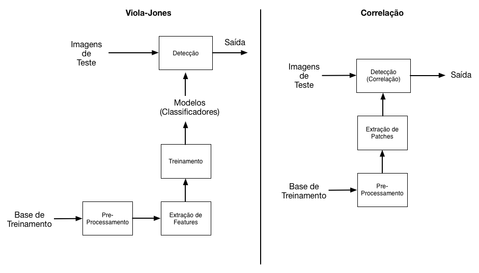

```{r, echo=FALSE, message=FALSE, warning=FALSE}
# Load dependencies and dataset
#library(doMC)
#registerDoMC()
library(foreach)
load('./matlab/data/data.Rd')
```

## Agenda

1. Problemática
2. Objetivos
3. Fluxo de Trabalho
4. Pré-processamento e transformações
5. Algoritmos
6. Resultados


## Problemática: Detecção de Objetos em Imagens

#### Desafio disponível no *kaggle.com*: "Facial Keypoints Detection''

* Base de treinamento contendo 7049 imagens e suas coordenadas de pontos chaves: Olhos, Sobrancelhas, Nariz e Boca
* Base de teste com 1783 imagens


*Dados fornecidos pelo Dr. Yoshua Bengio, da University of Montreal*


## Objetivos

### Identificar e localizar a boca em uma face humana

Dados disponíveis na base:

- 'mouth_left_corner': canto esquerdo
- 'mouth_right_corner': canto direito
- 'mouth_center_top_lip': centro do lábio superior
- 'mouth_center_bottom_lip': centro do lábio inferior 

### Métrica de Avaliação
- RMSE entre as coordenadas detectadas e verdadeiras
- Comparar taxas de falso positivo e falso negativo

## Fluxo de Trabalho



## Pré-processamento

- Atribuir identificador `NaN` para dados (coordenadas) ausentes
- Converter imagens na base dadas como vetores 'Char' para matrizes `Int8` de dimensões $96 \times 96$
- Para o MATLAB, dividir estas matrizes por 255 e salvar as matrizes resultantes (com elementos no intervalo de 0 a 1) como imagens em *grayscale*
- No MATLAB, o contraste das imagens é melhorado por meio da função `imadjust` para facilitar a detecção

## Separação de Dados

- Os dados de teste da base disponibilizada pelo *Kaggle.com* não contém os dados verdadeiros, somente as imagens, já que se trata de uma competição.
- Separam-se os dados da base de treinamento em novos conjuntos: 
    - **Treino:** 80% 
    - **Teste:** 20% 

## Extração de *Features* e *Patches*

### *Patches*:
* Subimagens de interesse
* Usado no método de identifição através da correlação

### *Features*:
* Melhor representação do conhecimento em comparação aos pixels puros
* O uso de *features* permite operações muito mais rápidas 
* Haar features (features retangulares) - método de Viola-Jones


## *Baseline* estatístico: Correlação

Patch médio de todas as bocas na base de dados:
```{r, echo=FALSE, message=FALSE}
# Carrega funcao
source('meanPatch.R')
```

#### Lábio superior (*mouth_center_top_lip*)
```{r, cache=TRUE}
coord      <- "mouth_center_top_lip" 
patch_size <- 15 # e.g. 10 means we will have a square of 21x21 pixels (10+1+10). 
search_size <- 15 # e.g. would give a 5x5 (2+1+2) 
mean.patch <- meanPatch(coord, patch_size, TRUE) 
```

#### Lábio inferior (*mouth_center_bottom_lip*)
```{r, cache=TRUE}
coord      <- "mouth_center_bottom_lip" 
patch_size <- 15 # e.g. 10 means we will have a square of 21x21 pixels (10+1+10). 
search_size <- 15 # e.g. would give a 5x5 (2+1+2) 
mean.patch <- meanPatch(coord, patch_size, TRUE) 
```

#### Canto esquerdo (*mouth_left_corner*)
```{r, cache=TRUE}
coord      <- "mouth_left_corner" 
patch_size <- 15 # e.g. 10 means we will have a square of 21x21 pixels (10+1+10). 
search_size <- 15 # e.g. would give a 5x5 (2+1+2) 
mean.patch <- meanPatch(coord, patch_size, TRUE) 
```

#### Canto direito (*mouth_right_corner*)
```{r, cache=TRUE}
coord      <- "mouth_right_corner" 
patch_size <- 15 # e.g. 10 means we will have a square of 21x21 pixels (10+1+10). 
search_size <- 15 # e.g. would give a 5x5 (2+1+2) 
mean.patch <- meanPatch(coord, patch_size, TRUE) 
```

## Predição

* Correlação cruzada entre *patch* médio e uma região de busca na imagem
* Região de busca definida como um *grid*, em cujas coordenadas o *patch* médio é centrado iterativamente
* Detecção: coordenadas nas quais encontra-se a maior correlação


Definição do intervalo de busca:
```{r}
source('predictWithCorrelation.R')
search_size <- 20 # e.g. would give a 5x5 (2+1+2) 
```

#### Lábio superior (*mouth_center_top_lip*)
```{r, echo=FALSE, cache=TRUE, warning=FALSE}
coord      <- "mouth_center_top_lip" 
coord_x <- paste(coord, "x", sep="_")
coord_y <- paste(coord, "y", sep="_")
patch_size <- 21
mean.patch <- meanPatch(coord, patch_size, FALSE) 
```

```{r}
iImg = 5
estimated_p <- predictWithCorrelation(coord, search_size, mean.patch, iImg, TRUE) 
# Plot real point in green circle
points(96 - d.test[iImg, coord_x], 96 - d.test[iImg, coord_y], col="green")
# Compute error:
real_p <- c(d.test$mouth_center_top_lip_x[iImg], d.test$mouth_center_top_lip_y[iImg])
err <- estimated_p - real_p
sqrt(mean(err^2))
```


#### Lábio inferior (*mouth_center_bottom_lip*)
```{r, echo=FALSE, cache=TRUE, warning=FALSE}
coord      <- "mouth_center_bottom_lip" 
coord_x <- paste(coord, "x", sep="_")
coord_y <- paste(coord, "y", sep="_")
patch_size <- 10
mean.patch <- meanPatch(coord, patch_size, FALSE) 
```

```{r}
iImg = 4
estimated_p <- predictWithCorrelation(coord, search_size, mean.patch, iImg, TRUE) 
# Plot real point in green circle
points(96 - d.test[iImg, coord_x], 96 - d.test[iImg, coord_y], col="green")
# Compute error:
real_p <- c(d.test$mouth_center_top_lip_x[iImg], d.test$mouth_center_top_lip_y[iImg])
err <- estimated_p - real_p
sqrt(mean(err^2))
```


#### Canto esquerdo (*mouth_left_corner*)
```{r, echo=FALSE, cache=TRUE, warning=FALSE}
coord      <- "mouth_left_corner" 
coord_x <- paste(coord, "x", sep="_")
coord_y <- paste(coord, "y", sep="_")
patch_size <- 10
mean.patch <- meanPatch(coord, patch_size, FALSE) 
```

```{r}
iImg = 4
estimated_p <- predictWithCorrelation(coord, search_size, mean.patch, iImg, TRUE) 
# Plot real point in green circle
points(96 - d.test[iImg, coord_x], 96 - d.test[iImg, coord_y], col="green")
# Compute error:
real_p <- c(d.test$mouth_center_top_lip_x[iImg], d.test$mouth_center_top_lip_y[iImg])
err <- estimated_p - real_p
sqrt(mean(err^2))
```


#### Canto direito (*mouth_right_corner*)
```{r, echo=FALSE, cache=TRUE, warning=FALSE}
coord      <- "mouth_right_corner" 
coord_x <- paste(coord, "x", sep="_")
coord_y <- paste(coord, "y", sep="_")
patch_size <- 10
mean.patch <- meanPatch(coord, patch_size, FALSE) 
```

```{r}
iImg = 4
estimated_p <- predictWithCorrelation(coord, search_size, mean.patch, iImg, TRUE) 
# Plot real point in green circle
points(96 - d.test[iImg, coord_x], 96 - d.test[iImg, coord_y], col="green")
# Compute error:
real_p <- c(d.test$mouth_center_top_lip_x[iImg], d.test$mouth_center_top_lip_y[iImg])
err <- estimated_p - real_p
sqrt(mean(err^2))
```


## Método de Viola-Jones

Ver [@viola_jones_paper2001]

1. Representação Integral e extração de *features* retangulares
2. Construção de classificadores através da seleção de Features com AdaBoost
3. Cascateamento de classificadores

* Neste algoritmo, o treinamento dos classificadores é longo, mas a detecção é muito rápida
    * Segundo [@viola_jones_paper2001], para imagens 384 x 288 e utilizando processador 700MHz, este algoritmo detecta faces a uma taxa de 15 imagens por segundo
    
    
## *Features* retangulares

* Reminescentes das funções base de wavelets Haar
* Captura de padrões em orientação horizontal, vertical e diagonal


### Tipos
* **(A e B)** - "dois-retângulos": valor é a diferença entre a soma dos pixels de cada um dos retângulos 
$$ \text{feature} = \text{soma ret. branco} - \text{soma ret. preto} $$
* **(C)** - "três-retângulos" : soma dos pixels nos dois retângulos externos subtraída da soma dos pixels no retângulo interno
$$ \text{feature} = \text{soma rets. brancos} - \text{soma ret. preto} $$
* **(D)** - "quatro-retângulos": diferença entre as somas dos pixels dos pares de retângulos diagonais
$$ \text{feature} = \text{soma rets. brancos} - \text{soma rets. pretos} $$

**Nota:** número extremamente elevado de combinações de features em uma imagem. 
    
    * Uma imagem 24 x 24 possui mais de 160 mil features!

## Representação Imagem Integral
* Esta representação é uma das três contribuições principais do trabalho de Viola-Jones
* Valor em $(x, y)$ corresponde à soma de todos os pixels acima e à esquerda de $(x, y)$, inclusive
* Há recorrência. 
    * Exemplo: valor na em $(x+1, y)$ é dado pelo valor em $(x, y)$ acrescido do valor da representação original em $(x+1, y)$
* É possível calcular a representação integral com uma única "passada" na imagem 
* A partir da representação integral pode-se: 
    1. calcular a soma dos valores dos pixels em um retângulo a partir de 4 referências (os cantos);
    2. a diferença entre a soma de dois retângulos a partir de 8 referências
* Ferramenta poderosa pra calcular os *features* retangulares com baixo custo computacional 

#### Número de referências pra cada *Feature*
* Tipo "dois-retângulos": 6 (reduz-se de 8 pra 6 devido serem adjacentes)
* Tipo "três-retângulos": 8
* Tipo "quatro-retângulos": 9

**Nota**: ainda que o custo computacional para calcular um *feature* seja muito baixo, o número de Features possíveis em uma imagem $96 \times 96$ é tão grande que esta computação é proibitiva 
    

## Construção de classificadores
* Utilização  de todo o conjunto de Features é proibitiva
    * Em uma imagem 384 x 288 pixels, há 180.000 features!
* Objetivo: combinar um número pequeno de Features para formar um classificador efetivo
* *AdaBoost*: usado tanto para selecionar um pequeno número de *features* como para treinar o classificador 
* **Imagens positivas e negativas**: contém e não contém o objeto alvo, respectivamente
* *Weak learners*: classificadores simples
* *Boosting*: provê a habilidade de treinar um classificador com alta acurácia a partir da média ponderada das decisões feitas por *weak learners*

## *Strong Classifiers* em cascata
* Formado por estágios
* Cada estágio é composto por um conjunto de *weak learners*
* Cada *strong classifier* é treinado somente a partir das amostras que passam dos classificadores precedentes
* Se em um dado estágio a sub-janela sendo inspecionada for rejeitada (classificada como negativa), o processamento desta sub-janela se encerra e a próxima janela passa a ser inspecionada
* Falsos-positivos são aceitáveis, enquanto falsos-negativos devem ocorrer a uma taxa próxima de 0%
* **Taxa global de falsos-positivos e de detecção**: dadas pelo produto das respectivas taxas individuais de cada estágio
* Como o objetivo para a taxa global de falsos-positivos é atingir um número tão baixo quanto possível, pode-se utilizar estágios com performances ruins e ainda assim atingir uma performance global satisfatória (exemplo: dois estágios com 60% de falsos-positivos resultam em uma cascata com 36% de falsos-positivos)
* Em contraste, para uma taxa global de detecção tão próxima quando possível de 100%, os estágios precisam ter performances individuais igualmente próximas de 100%

<!--
The cascade classifier consists of stages, where each stage is an ensemble of weak learners. The weak learners are simple classifiers called decision stumps. Each stage is trained using a technique called boosting. Boosting provides the ability to train a highly accurate classifier by taking a weighted average of the decisions made by the weak learners.

Each stage of the classifier labels the region defined by the current location of the sliding window as either positive or negative. Positive indicates an object was found and negative indicates no object. If the label is negative, the classification of this region is complete, and the detector slides the window to the next location. If the label is positive, the classifier passes the region to the next stage. The detector reports an object found at the current window location when the final stage classifies the region as positive.

The stages are designed to reject negative samples as fast as possible. The assumption is that the vast majority of windows do not contain the object of interest. Conversely, true positives are rare, and worth taking the time to verify. A true positive occurs when a positive sample is correctly classified. A false positive occurs when a negative sample is mistakenly classified as positive. A false negative occurs when a positive sample is mistakenly classified as negative. To work well, each stage in the cascade must have a low false negative rate. If a stage incorrectly labels an object as negative, the classification stops, and there is no way to correct the mistake. However, each stage may have a high false positive rate. Even if it incorrectly labels a nonobject as positive, the mistake can be corrected by subsequent stages.

The overall false positive rate of the cascade classifier is fs, where f is the false positive rate per stage in the range (0 1), and s is the number of stages. Similarly, the overall true positive rate is ts, where t is the true positive rate per stage in the range (0 1]. Thus, you can see that adding more stages reduces the overall false-postive rate, but it also reduces the overall true positive rate."
-->


## Resultados

### Correlação 


## Resultados

### Viola-Jones 


## Acurácia


## Referências


