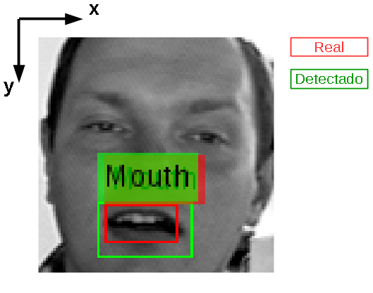

```{r, echo=FALSE, message=FALSE, warning=FALSE}
# Load dependencies and dataset
library(doMC)
registerDoMC()
library(foreach)
load('./matlab/data/data.Rd')
```

## Agenda

1. Problemática
2. Objetivos
3. Fluxo de Trabalho
4. Pré-processamento e transformações
5. Algoritmos
6. Resultados


## Problemática: Detecção de Objetos em Imagens

#### Desafio disponível no *kaggle.com*: "Facial Keypoints Detection''

* Base de treinamento contendo 7049 imagens e suas coordenadas de pontos chaves: Olhos, Sobrancelhas, Nariz e Boca
* Base de teste com 1783 imagens


*Dados fornecidos pelo Dr. Yoshua Bengio, da University of Montreal*


## Objetivos

### Identificar e localizar a boca em uma face humana

Dados disponíveis na base:

- 'mouth_left_corner': canto esquerdo
- 'mouth_right_corner': canto direito
- 'mouth_center_top_lip': centro do lábio superior
- 'mouth_center_bottom_lip': centro do lábio inferior 

### Métrica de Avaliação
- RMSE entre as coordenadas detectadas e verdadeiras

## Fluxo de Trabalho


## Pré-processamento

- Atribuir identificador `NaN` para dados (coordenadas) ausentes
- Converter imagens dadas na base como vetores 'Char' para matrizes `Int8` de dimensões $96 \times 96$
- Para o MATLAB, dividir estas matrizes por 255 e salvar as matrizes resultantes (com elementos no intervalo de 0 a 1) representativas de imagens em *grayscale*

## Separação de Dados

- Separam-se os dados da base de treinamento em novos conjuntos: 
    - **Treino:** 80% 
    - **Teste:** 20% 

## Extração de *Features* e *Patches*

### *Patches*:
* Subimagens de interesse
* Usado no método de identifição através da correlação

### *Features*:
* Melhor representação do conhecimento em comparação aos pixels puros
* O uso de *features* permite operações muito mais rápidas 
* Haar features (features retangulares) - método de Viola-Jones


## *Baseline* estatístico: Correlação

Patch médio de todas as bocas na base de dados:
```{r, echo=FALSE, message=FALSE}
source('meanPatch.R')
```

#### Lábio superior (*mouth_center_top_lip*)

Definir coordenada:
```{r, cache=TRUE}
coord      <- "mouth_center_top_lip" 
```

Definir dimensão do *patch*:
```{r, cache=TRUE}
patch_size <- 15  # e.x. 10 significaria um quadrado de 21x21 pixels (10+1+10).  
``` 

Calcular *patch* médio:
```{r, cache=TRUE}
mean.patch <- meanPatch(coord, patch_size, TRUE) 
```


#### Lábio inferior (*mouth_center_bottom_lip*)
```{r, cache=TRUE, echo=FALSE}
coord      <- "mouth_center_bottom_lip" 
patch_size <- 15 
mean.patch <- meanPatch(coord, patch_size, TRUE) 
```

#### Canto esquerdo (*mouth_left_corner*)

Observar enantiomorfismo:
```{r, cache=TRUE, echo=FALSE}
coord      <- "mouth_left_corner" 
patch_size <- 15 
mean.patch <- meanPatch(coord, patch_size, TRUE) 
```

#### Canto direito (*mouth_right_corner*)
```{r, cache=TRUE, echo=FALSE}
coord      <- "mouth_right_corner" 
patch_size <- 15 
mean.patch <- meanPatch(coord, patch_size, TRUE) 
```

## Predição

* Correlação cruzada entre *patch* médio e uma região de busca na imagem
* Região de busca definida como um *grid*, em cujas coordenadas o *patch* médio é centrado iterativamente
* Detecção: coordenadas nas quais encontra-se a maior correlação


```{r, cache=TRUE}
source('predictWithCorrelation.R')
```

Definir intervalo de busca:
```{r, cache=TRUE}
search_size <- 20 # e.g. would give a 5x5 (2+1+2) 
```

#### Lábio superior (*mouth_center_top_lip*)
```{r, echo=FALSE, cache=TRUE, warning=FALSE}
coord      <- "mouth_center_top_lip" 
coord_x <- paste(coord, "x", sep="_")
coord_y <- paste(coord, "y", sep="_")
patch_size <- 21
mean.patch <- meanPatch(coord, patch_size, FALSE) 
```

```{r}
iImg = 4 # Escolher imagem
# Estimar coordenadas usando correlacao e plotar em vermelho:
estimated_p <- predictWithCorrelation(coord, search_size, mean.patch, iImg, TRUE) 
# Plotar coordenadas reais em verde:
points(96 - d.test[iImg, coord_x], 96 - d.test[iImg, coord_y], col="green")
```

```{r}
# RMSE:
real_p <- c(d.test$mouth_center_top_lip_x[iImg], d.test$mouth_center_top_lip_y[iImg])
err <- estimated_p - real_p
sqrt(mean(err^2))
```

```{r, echo=FALSE, cache=TRUE}
d_mouth_center_top_lip <- estimated_p
```


#### Lábio inferior (*mouth_center_bottom_lip*)
```{r, echo=FALSE, cache=TRUE, warning=FALSE}
coord      <- "mouth_center_bottom_lip" 
coord_x <- paste(coord, "x", sep="_")
coord_y <- paste(coord, "y", sep="_")
patch_size <- 10
mean.patch <- meanPatch(coord, patch_size, FALSE) 
```

```{r, echo=FALSE, cache=TRUE}
estimated_p <- predictWithCorrelation(coord, search_size, mean.patch, iImg, TRUE) 
# Plotar coordenadas reais em verde:
points(96 - d.test[iImg, coord_x], 96 - d.test[iImg, coord_y], col="green")
```

RMSE:
```{r, echo=FALSE, cache=TRUE}
# Erro:
real_p <- c(d.test$mouth_center_bottom_lip_x[iImg], d.test$mouth_center_bottom_lip_y[iImg])
err <- estimated_p - real_p
sqrt(mean(err^2))
```

```{r, echo=FALSE, cache=TRUE}
d_mouth_center_bottom_lip_x <- estimated_p
```

#### Canto esquerdo (*mouth_left_corner*)
```{r, echo=FALSE, cache=TRUE, warning=FALSE}
coord      <- "mouth_left_corner" 
coord_x <- paste(coord, "x", sep="_")
coord_y <- paste(coord, "y", sep="_")
patch_size <- 10
mean.patch <- meanPatch(coord, patch_size, FALSE) 
```

```{r, echo=FALSE, cache=TRUE}
estimated_p <- predictWithCorrelation(coord, search_size, mean.patch, iImg, TRUE) 
# Plotar coordenadas reais em verde:
points(96 - d.test[iImg, coord_x], 96 - d.test[iImg, coord_y], col="green")
```

RMSE:
```{r, echo=FALSE, cache=TRUE}
real_p <- c(d.test$mouth_left_corner_x[iImg], d.test$mouth_left_corner_y[iImg])
err <- estimated_p - real_p
sqrt(mean(err^2))
```

```{r, echo=FALSE, cache=TRUE}
d_mouth_left_corner <- estimated_p
```

#### Canto direito (*mouth_right_corner*)
```{r, echo=FALSE, cache=TRUE, warning=FALSE}
coord      <- "mouth_right_corner" 
coord_x <- paste(coord, "x", sep="_")
coord_y <- paste(coord, "y", sep="_")
patch_size <- 10
mean.patch <- meanPatch(coord, patch_size, FALSE) 
```

```{r, echo=FALSE, cache=TRUE}
estimated_p <- predictWithCorrelation(coord, search_size, mean.patch, iImg, TRUE) 
# Plotar coordenadas reais em verde:
points(96 - d.test[iImg, coord_x], 96 - d.test[iImg, coord_y], col="green")
```

RMSE:
```{r, echo=FALSE, cache=TRUE}
real_p <- c(d.test$mouth_right_corner_x[iImg], d.test$mouth_right_corner_y[iImg])
err <- estimated_p - real_p
sqrt(mean(err^2))
```

```{r, echo=FALSE, cache=TRUE}
d_mouth_right_corner <- estimated_p
```


### Retângulo com detecção:
```{r}
im  <- matrix(data=rev(im.test[iImg,]), nrow=96, ncol=96)
image(1:96, 1:96, im, col=gray((0:255)/255))
xleft <- 96 - d_mouth_left_corner[1]
ybottom <- 96 - d_mouth_center_bottom_lip_x[2]
xright <- 96 - d_mouth_right_corner[1]
ytop <- 96 - d_mouth_center_top_lip[2]

rect(xleft, ybottom, xright, ytop, lwd=2, border="green" );
```

## Método Correlação - Observações

* Acurácia satisfatória
* Para obter os melhores resultados, é necessário otimizar:
    * a dimensão do *patch* 
    * o campo de busca
* **Custo computacional extremamente elevado**


## Método de Viola-Jones

Ver [@viola_jones_paper2001]

1. Representação Integral e extração de *features* retangulares
2. Construção de classificadores através da seleção de Features com AdaBoost
3. Cascateamento de classificadores

* Treinamento dos classificadores é extremamente longo, mas a detecção passa a ser muito rápida
    * Segundo [@viola_jones_paper2001], para imagens 384 x 288 e utilizando processador 700MHz, este algoritmo detecta faces a uma taxa de 15 imagens por segundo
    
    
## *Features* retangulares

* Reminescentes das funções base de *wavelets* Haar
* Captura de padrões em orientação horizontal, vertical e diagonal


### Tipos
* **(A e B)** - "dois-retângulos": valor é a diferença entre a soma dos pixels de cada um dos retângulos 
$$ \text{feature} = \text{soma ret. branco} - \text{soma ret. preto} $$
* **(C)** - "três-retângulos" : soma dos pixels nos dois retângulos externos subtraída da soma dos pixels no retângulo interno
$$ \text{feature} = \text{soma rets. brancos} - \text{soma ret. preto} $$
* **(D)** - "quatro-retângulos": diferença entre as somas dos pixels dos pares de retângulos diagonais
$$ \text{feature} = \text{soma rets. brancos} - \text{soma rets. pretos} $$

## Representação Imagem Integral
* Uma das três contribuições principais do trabalho de Viola-Jones
* Valor em $(x, y)$ corresponde à soma de todos os pixels acima e à esquerda de $(x, y)$, inclusive
* Há recorrência:
    * Exemplo: valor em $(x+1, y)$ é dado pelo valor em $(x, y)$ acrescido do valor na representação original em $(x+1, y)$
* É possível calcular a representação integral com uma única "passada" na imagem 
* A partir da representação integral pode-se: 
    1. calcular a soma dos valores dos pixels em um retângulo a partir de 4 referências (os cantos);
    2. a diferença entre a soma de dois retângulos a partir de 8 referências
* Ferramenta poderosa pra calcular os *features* retangulares com baixo custo computacional 

#### Número de referências pra cada *Feature*
* Tipo "dois-retângulos": 6 (reduz-se de 8 pra 6 devido serem adjacentes)
* Tipo "três-retângulos": 8
* Tipo "quatro-retângulos": 9

**Nota**: custo computacional para calcular um *feature* é baixo, mas o número de *features* possíveis em uma imagem é extremamente elevado
    
    * Uma imagem 24 x 24 possui mais de 160 mil features!    

## Construção de classificadores
* Utilização  de todo o conjunto de *features* é proibitiva    
* Objetivo: combinar um número pequeno de *features* para formar um classificador efetivo
* *AdaBoost*: usado tanto para selecionar um pequeno número de *features* como para treinar o classificador 
* *Weak learners*: classificadores simples
* *Boosting*: provê a habilidade de treinar um classificador com alta acurácia a partir da média ponderada das decisões feitas por *weak learners*

## *Strong Classifiers* em cascata
* Formado por estágios
* Cada estágio é composto por um conjunto de *weak learners*
* Cada *strong classifier* é treinado somente a partir das amostras que passam dos classificadores precedentes
* Sub-janelas são inspecionadas, passando pelos estágios do classificador em cascata
* Classificações:
    * **Negativa**: processamento se encerra e a próxima sub-janela passa a ser inspecionada
    * **Positiva**: sub-janela continua a ser processada pelo próximo estágio do classificador
* Falsos-positivos são aceitáveis, enquanto falsos-negativos devem ocorrer a uma taxa próxima de 0%
* **Taxa global de falsos-positivos e de detecção**: dadas pelo produto das respectivas taxas individuais ($f_k$) de cada um dos $M$ estágios $$ f = \prod \limits_{k=0}^{M-1} f_k$$
* Estágios com performances individuais ruins podem atingir uma performance global satisfatória (*e.g.* 2 x 60% = 36%)
* Para uma taxa global de detecção (verdadeiro-positivo) tão próxima quando possível de 100%, os estágios precisam ter performances individuais igualmente próximas de 100%

## Treinando um Classificador

* Classificadores pré-treinados em `vision.CascadeObjectDetector` (MATLAB)
* Viola-Jones é preferível para objetos cuja razão de aspecto não varia significativamente
* Necessário conjunto de imagens positivas e negativas
* Objeto encontrado em uma imagem negativa: falso-positivo - será passado como imagem negativa para o treinamento do próximo estágio do classificador 
* Amostra positiva classificada erroneamente como negativa: é descartada, isto é, não é usada no treinamento dos estágios seguintes
* Amostras positivas podem se esgotar antes que todos os estágios estejam treinados

### Relações de compromisso:
* **Mais estágios**:
    * Melhora taxa de falsos-positivos
    * Piora taxa de verdadeiros-positivos
    * Piora taxa de falsos-negativos (mais estágios, maior probabilidade de rejeição)
    * Necessita de mais imagens negativas para treinamento (somente falsos-positivos são passados como imagens negativas aos estágios seguintes)

### Práticas
* Como a base de dados é relativamente grande, pode-se aumentar o número de estágios e relaxar (aumentar) as especificações de taxa de falsos-positivos em cada estágio (alvo)
* Para economizar tempo, tunar os parâmetros usando *features* LBP ou HOG
* Geração de amostras positivas a partir de rotações, adição de ruído ou mudança de contraste
* Utilizar imagens negativas com fundos e cenários semelhantes às imagens positivas
* Melhorar o contraste das imagens por meio da função `imadjust`

<!--


-->

## Viola-Jones: Resultados

* Detecção com coordenadas mais baixas é a escolhida 



## Acurácia

* Detector disponível no *toolbox Computer Vision* no MATLAB: $$\text{RMSE} = 2.8097$$

### Taxas de falso positivo e falso negativo


## Referências


